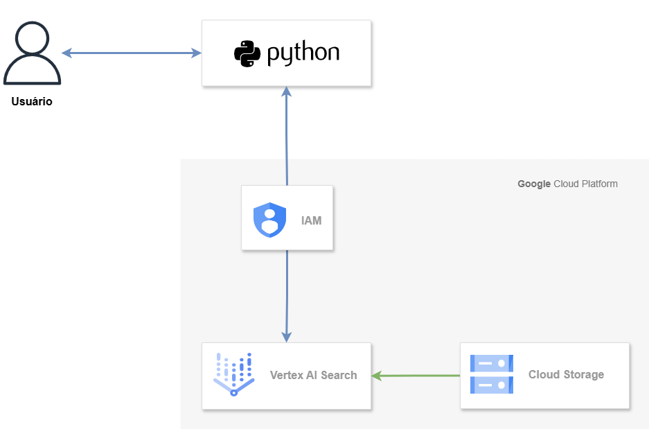

# Vertex AI Search & Gemini RAG

Aplicação de **RAG (Retrieval-Augmented Generation)** desenvolvida para consumir uma base de conhecimento corporativa hospedada no **Google Cloud AI Applications** (Vertex AI Agent Builder).

O sistema utiliza a biblioteca LangChain para recuperar documentos indexados no Google Cloud e o modelo **Gemini** para gerar respostas fundamentadas e naturais.

## Objetivo e Contexto

Esta aplicação foi desenhada para atuar como o "cérebro" de processamento de linguagem natural sobre seus dados privados. Ela parte da premissa de que você já possui um repositório de dados (Data Store) criado na ferramenta **AI Applications** do Google Cloud, indexando documentos do Cloud Storage.

Abaixo segue o diagrama do fluxo de dados da solução:

<div align="center">
    
</div>

<br>

O fluxo de valor é:
1. Receber uma pergunta.
2. Consultar o **AI Applications** para buscar trechos relevantes.
3. Enviar o contexto + pergunta para o Gemini.
4. Retornar a resposta processada.

Embora a aplicação atual esteja configurada com uma interface de linha de comando (CLI) para testes imediatos, sua arquitetura modular (separação entre `search_engine` e `model_response`) foi projetada para ser flexível.

Ela pode ser facilmente adaptada para operar em ambientes serverless e de microsserviços, tais como:

* **Google Cloud Functions:** Para atuar como um **Webhook** (ex: backend de chatbots).
* **Google Cloud Run:** Para ser disponibilizada como uma **API REST** escalável.
* **Integrações:** Backend para aplicações frontend que necessitam de busca inteligente.

## Configuração do Ambiente

A aplicação depende de variáveis de ambiente e bibliotecas específicas para funcionar. Siga os passos abaixo para configurar os arquivos necessários.

### 1. Definindo as Variáveis (.env)

O projeto inclui um arquivo modelo chamado `.env.example`. Você deve criar um arquivo chamado `.env` na raiz do projeto e preenchê-lo com as credenciais do seu projeto no Google Cloud.

Conteúdo necessário no `.env`:

```ini
PROJECT_ID="seu-id-do-projeto-gcp"
LOCATION_ID="global" # Ou a região específica (ex: us-central1) definida no AI Applications
DATA_STORE_ID="seu-id-do-datastore" # ID do repositório criado no Agent Builder
MODEL="gemini-1.5-pro" # Modelo generativo a ser utilizado
```

## Referências:

* [LangChain Integration: Vertex AI Search](https://python.langchain.com/docs/integrations/retrievers/google_vertex_ai_search/)
* [Google Cloud Samples: Gen AI SDK Configuration](https://cloud.google.com/vertex-ai/generative-ai/docs/samples/googlegenaisdk-textgen-config-with-txt)